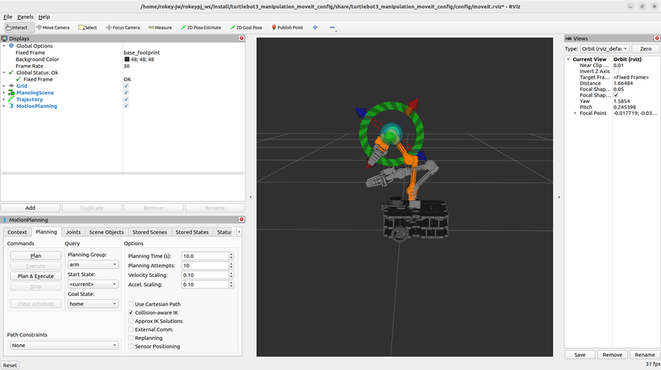

<p align="center">
  
  
  
  
  
  
  
  
  
</p>

# TurtleBot3 Waffle + Manipulation 프로젝트

이 프로젝트는 **ROS 2 Humble**, **Ubuntu 22.04**, **Python 3.10** 환경에서 동작하며, TurtleBot3 Manipulator와 비전 기반 객체 인식 및 조작 시스템을 통합한 로봇 플랫폼입니다. ArUco 마커와 YOLOv8을 활용해 객체를 탐지하고, MoveIt2를 통해 로봇팔을 제어합니다.

---

## 👨‍💻 결과 영상
<p align="center">
  <video controls src="./docs/result.mp4" title="결과 영상(1.5배속)" width="70%"></video>
</p>

---

## 👨‍💻 담당 업무 소개

<p align="center">
  
</p>

* 본 프로젝트 중, **Aruco + Manipulator 시스템의 제어 기능 개발**을 담당
    * 실제와 맞게 URDF 수정
        * 오픈소스 로봇과 제공받은 로봇의 차이 존재
    * 9x7 checker board를 활용하여 카메라 캘리브레이션 진행
    * ArUco 마커를 이용한 객체의 **3D 위치 (x, y, z) 및 자세 (roll, pitch, yaw) 추출**
    * **C++ 기반 MoveIt2**를 사용해 Manipulator제어
        * Gripper 제어 및 조작 로직 구현 포함
    * Gazebo 시뮬레이션 및 실제 하드웨어(TurtleBot3 + Manipulator) 환경 모두에서 구동 완료

## 📦 주요 패키지 구성

### `aruco_yolo`
* ArUco 마커 및 YOLOv8 기반 객체 탐지, MoveIt2 제어 연동
* 주요 파일: `aruco_detector.py`, `yolo_detector.py`, `pick_n_place.py`, `moveit_client.py`
* 런치: `aruco_last.launch.py`

### `grasp_executor_cpp`
* C++ 기반 grasp 자동화 구현 (ArUco + MoveIt2)
* 주요 파일: `grasp_executor_aruco.cpp`, `grasp_executor_aruco_auto.cpp`

### `lane_detect`
* 카메라 기반 차선 인식 (OpenCV 활용)
* 주요 파일: `camera_processing.py`, `slide_window.py`

### `sample_pkg`
* ArUco, YOLO, 카메라 보정, 자동 태스크 실행 등 실험 코드 집합

### `turtlebot3_manipulation` 패키지 그룹
* TurtleBot3 Manipulator 시뮬레이션 및 제어 전체 구성
* `bringup`: Gazebo 및 실제 하드웨어 실행 (launch, config)
* `description`: URDF, 메쉬
* `cartographer`: SLAM 및 RViz 시각화 설정

### `turtlebot3_msgs`, `turtlebot_cosmo_interface`
* 메시지 정의 및 인터페이스용 보조 패키지

---

## 🚀 실행 예시

```bash
# webcam start
ros2 run v4l2_camera v4l2_camera_node

# 실제 하드웨어
ros2 launch turtlebot3_manipulation_bringup hardware.launch.py

# ArUco + YOLO + Manipulator
ros2 launch aruco_yolo aruco_last.launch.py

# lane detection & AMR controller
ros2 run lane_detect subscriber_node

# 옵션 : Moveit2 + Grasp executor (C++)
ros2 launch grasp_executor_cpp grasp_system.launch.py

# 옵션 : Gazebo 시뮬레이션
ros2 launch turtlebot3_manipulation_bringup gazebo.launch.py
```
---

## 📄 Documentation

- 이 프로젝트에 대한 자세한 설명은 다음 문서를 참고해 주세요.   
👉 [F-2_협동3_이재호_배재성_전유진_정은영.pdf](./docs/F-2_협동3_이재호_배재성_전유진_정은영.pdf)

---

## 🙋 기여

이 프로젝트에 기여해주신 모든 분들께 감사드립니다.
<table>
  <tr>
    <td align="center">
      <a href="https://github.com/jsbae-RL">
        <br />
        <sub><b>jsbae-RL</b></sub>
      </a>
    </td>
    <td align="center">
      <a href="https://github.com/yujin114">
        <br />
        <sub><b>yujin114</b></sub>
      </a>
    </td>
    <td align="center">
      <a href="https://github.com/ethica-alt">
        <br />
        <sub><b>ethica-alt</b></sub>
      </a>
    </td>
    <td align="center">
      <a href="https://github.com/SmiteLims">
        <br />
        <sub><b>SmiteLims</b></sub>
      </a>
    </td>
  </tr>
</table>
